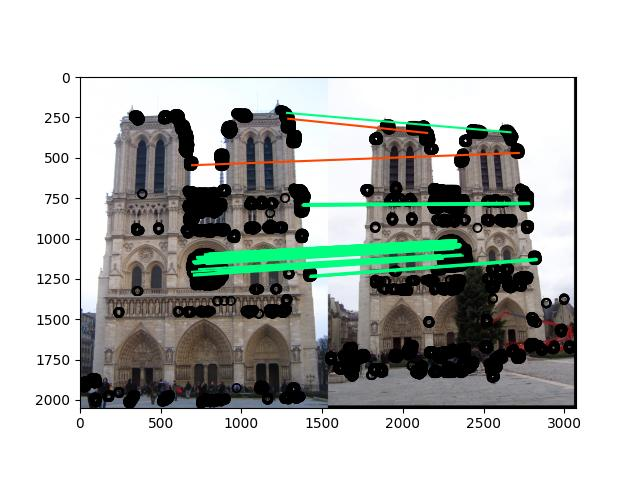
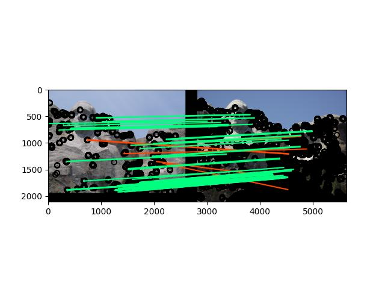
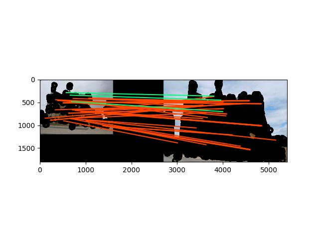

# Local Feature Matching
The objective of this project is to learn about extracting features from images and matching them.  
The project's logic is implemented in `student.py` in which I implemented three functions:  
- `get_interest_points`: extracts interest points using Harris Corner Detector.
- `get_features`: generates SIFT-like features. 
- `match_features`: matches the features generated from two images.

**To test the project, run**:`python main.py` then, you will be prompted to input a file name. 
Enter one of the following: `notre_dame`, `mt_rushmore` or `e_gaudi`.  

**Results**
---------- 

- **Notre Dame**  

> Number of matches after running the pipeline: 1102  
> Accuracy on 50 most confident: 100%  
> Accuracy on 100 most confident: 98%   
> Accuracy on all matches: 74%  

- **Mt Rushmore**  
 
> Number of matches after running the pipeline: 170  
> Accuracy on 50 most confident: 96%  
> Accuracy on 100 most confident: 94%  
> Accuracy on all matches: 91%  

- **E Gaudi**  
 
> Number of matches after running the pipeline: 44  
> Accuracy on all matches: 6%  
